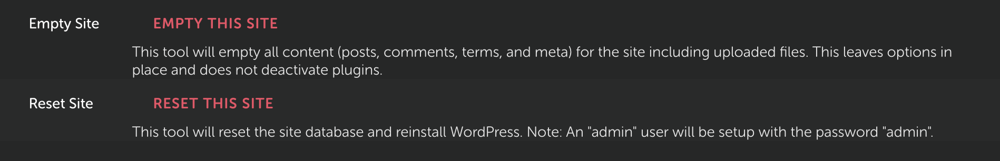

# Local Reset Site Add-on

This [Local Add-on](https://localwp.com) gives you two new tools that help you blow your test sites up 💥.

## Installation

### Requirements

* [Local](https://localwp.com/) 6.3.0+ ⚡️

### Option 1: Fast and easy install

1. Download the pre-packaged zip on the latest release, this is not the source code but the package attached.
2. Unzip the code to the associated directory for your OS (see [Clone](#clone))

### Option 2: Clone and Build

#### Clone

Clone the repository into the following directory depending on your platform:

-   macOS: `~/Library/Application Support/Local/addons`
-   Windows: `C:\Users\username\AppData\Roaming\Local\addons`
-   Debian Linux: `~/.config/Local/addons`

#### Install Add-on Dependencies

`yarn install` or `npm install`

#### Add Add-on to Local

1. Clone repo directly into the add-ons folder (paths described above)
2. `yarn install` or `npm install` (install dependencies)
2. `yarn build` or `npm run build`
3. Open Local and enable add-on

## Usage

Screencast example: https://share.skc.dev/bLuR9gg6

### Empty Site

This tool will empty all content (posts, comments, terms, and meta) for the site including attachments.

This leaves options in place and does not deactivate plugins.

What it runs in WP-CLI: `wp site empty --uploads --yes`

### Reset Site

This tool will delete the entire site database and reinstall WordPress.

_Note: An "admin" user will be setup with the password "admin"._

What it runs in WP-CLI: `wp db reset --yes --defaults` and `wp core install --url=site.url --title=site.domain --admin_user=admin --admin_password=admin --admin_email=dev-email@flywheel.local --skip-email`

## Credits

Thanks to the [Modern Tribe](https://tri.be/) / [The Events Calendar](https://theeventscalendar.com/) teams for allowing me to work on this during work and ultimately letting me adopt it personally to continue maintaining it.

## License

MIT
